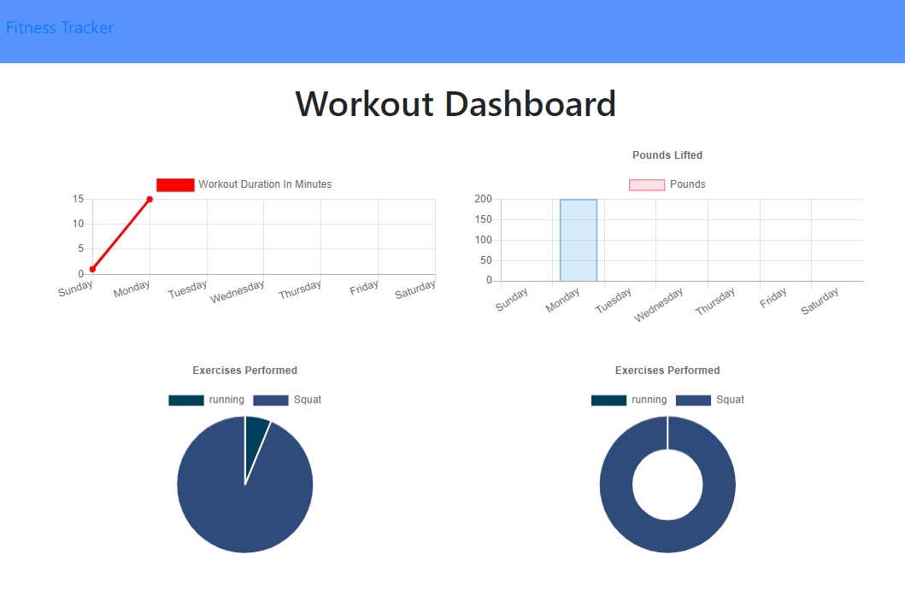
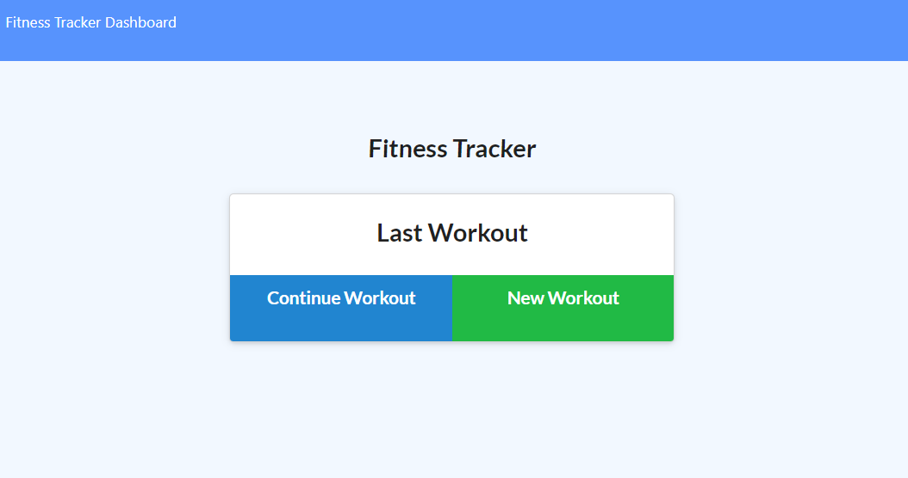
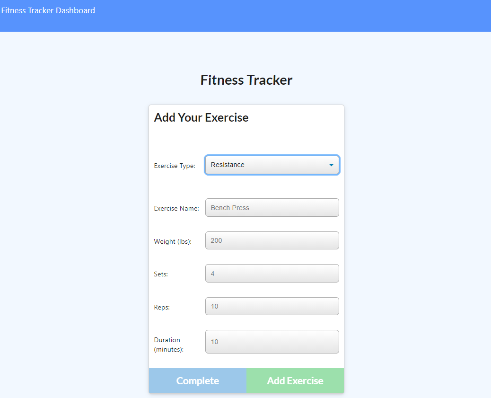

# 🏆 Workout-Tracker 🏆

##### **Badge:**

## **Description:**
* This is a workout tracker using MongoDB with a Mongoose schema and HTML and API routes.

## **Table of Contents:**
1. [Installation](#installation)
2. [Usage](#usage)
3. [Test](#test)
4. [Link](#link)
5. [Screenshots](#screenshots)

## **Installation:**
* We use the following NPM packages: `Express`, `MongoDB`, `Mongoose`, `Path`, `Mongojs` and `Morgan`. 

## **Usage:**
* This app can be use by ay person trying to stay fit and keep track of his/her workout. 

### **Questions:**
* If you have any question, please contact me at will@will.com

### **Link:**
* [GitHub] - https://github.com/williamsffc

### **Screenshots:**

-------------
© Copyright - 2020

